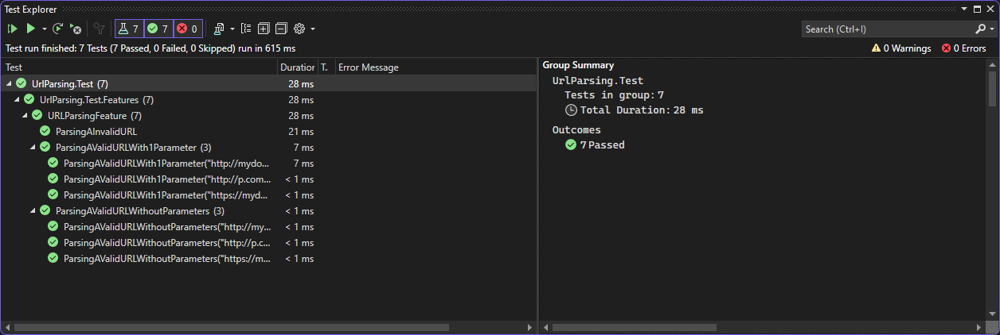

= R5.A.08 -- Dépôt pour les TPs
:icons: font
:MoSCoW: https://fr.wikipedia.org/wiki/M%C3%A9thode_MoSCoW[MoSCoW]

Ce dépôt concerne les rendus de mailto:loan.gayrard@etu.univ-tlse2.fr[Loan Gayrard].

== TP1

=== Code de is_it_friday_yet.feature

----
Feature: An example

  Scenario: today is Sunday
    Given today is Sunday
    When I ask whether it's Friday yet
    Then I should be told "Nope"

  Scenario: today is Friday
    Given today is Friday
    When I ask whether it's Friday yet
    Then I should be told "TGIF"

  Scenario: today is Tuesday
    Given today is Tuesday
    When I ask whether it's Friday yet
    Then I should be told "Nope"
----

=== Screen des tests Cucumber

image::assets/images/TP1/ScreenTP1_Cucumber_Tests.png[width=100%]

== TP2

=== Code java

[,java]
----
package dojo;

import java.util.List;
import java.util.ArrayList;

public class Order {

    private String owner;
    private String target;
    private List<String> cocktails;

    public Order() {
        this.owner = null;
        this.target = null;
        this.cocktails = new ArrayList<String>();
    }

    public Order(String owner, String target) {
        this.owner = owner;
        this.target = target;
    }

    public void declareOwner(String owner) {
        this.owner = owner;
    }

    public String getOwner() {
        return this.owner;
    }

    public void declareTarget(String target) {
        this.target = target;
    }

    public String getTarget() {
        return this.target;
    }

    public void declareCocktails(List<String> cocktails) {
        this.cocktails = cocktails;
    }

    public List<String> getCocktails() {
        return this.cocktails;
    }
}
----

=== Exécution des tests

image::assets/images/TP2/ScreenTP2_Cucumber_Tests.png[width=100%]

== TP3

=== Contenu du fichier urlParsing.feature

[,feature]
----
Feature: URL Parsing

Scenario Outline: Parsing a valid URL without parameters
    Given the URL <url>
    When i parse the URL
    Then the result should have the protocol <protocol>
    And the result should have the domain <domain>
    And the result should have the path <path>

	Examples: 
	| url                             | protocol | domain        | path       |
	| http://mydomain.com             | http     | mydomain.com  | /          |
	| https://mydomain2.com/getValues | https    | mydomain2.com | /getValues |
	| http://p.com/a?question=how_to  | http     | p.com         | /a         |

Scenario: Parsing a invalid URL
	Given the URL "My name is Loan"
	Then the parser should return an object with null values

Scenario: Parsing a valid URL with 1 parameter
    Given the URL <url>
	When i parse the URL
	Then the result should have the protocol <protocol>
    And the result should have the domain <domain>
    And the result should have the path <path>
	And the result should have the query <query>
	And the result should have the key <key> associated with the value <value>

	Examples: 
| url                            | protocol | domain        | path | query           | key | value       |
| http://mydomain.com/a?q=a      | http     | mydomain.com  | /a   | ?q=a            | q   | a           |
| https://mydomain2.com/jf?j=w   | https    | mydomain2.com | /jf  | ?j=w            | j   | w           |
| http://p.com/awf?q=howtobeat15 | http     | p.com         | /awf | ?q=howtobeat15  | q   | howtobeat15 |

----

=== Contenu du fichier ParsingStepDefinitions.cs

[,c#]
----
using NUnit.Framework;
using UrlParsing;

namespace UrlParsing.Test.StepDefinitions
{

    [Binding]
    public class ParsingStepDefinitions
    {
        private readonly ScenarioContext _scenarioContext;
        private UrlParsing.UrlInfo _urlInfo = new();
        private string _url;

        public ParsingStepDefinitions(ScenarioContext scenarioContext)
        {
            _scenarioContext = scenarioContext;
        }

        [Given("the URL (.*)")]
        public void given_the_url(string url)
        {
            _url = url;
        }

        [When("i parse the URL")]
        public void when_i_parse_the_url()
        {
            _urlInfo = UrlParser.ParseUrl(_url);
        }

        [Then("the parser should return an object with null values")]
        public void then_the_parser_should_return_an_object_with_null_values()
        {
            _urlInfo = UrlParser.ParseUrl(_url);
            Assert.IsNull(_urlInfo.Protocol);
            Assert.IsNull(_urlInfo.Domain);
            Assert.IsNull(_urlInfo.Path);
            Assert.IsNull(_urlInfo.Query);
        }

        [Then("the result should have the protocol (.*)")]
        public void then_the_result_should_have_the_protocol(string protocol)
        {
            Assert.AreEqual(protocol, _urlInfo.Protocol);
        }

        [Then("the result should have the domain (.*)")]
        public void then_the_result_should_have_the_domain(string domain)
        {
            Assert.AreEqual(domain, _urlInfo.Domain);
        }

        [Then("the result should have the path (.*)")]
        public void then_the_result_should_have_the_path(string path)
        {
            Assert.AreEqual(path, _urlInfo.Path);
        }

        [Then("the result should have the query (.*)")]
        public void then_the_result_should_have_the_query(string query)
        {
            Assert.AreEqual(query, _urlInfo.Query);
        }

        [Then("the result should have the parameter (.*) with the value (.*)")]
        public void then_the_result_should_have_the_parameter_with_the_value(string parameter, string value)
        {
            Assert.AreEqual(_urlInfo.Parameters[parameter], value);
        }

        [Then("the result should have the key (.*) associated with the value (.*)")]
        public void then_the_result_query_should_have_the_key_associated_with_the_value(string key, string value)
        {
            Assert.AreEqual(_urlInfo.Parameters[key], value);
        }
    }
}

----

=== Objectifs des tests Cucumber

Les tests effectués ci-dessus ont permis de vérifier le bon fonctionnement de mon programme C#, qui permet de parser une URL et de récupérer les informations importantes de celle-ci.

=== Screen des tests complétés

