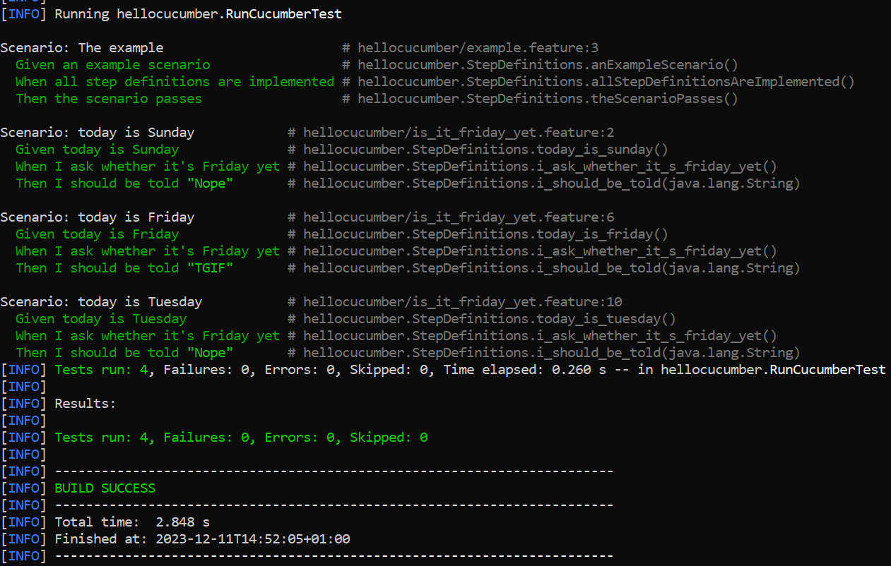

= R5.A.08 -- Dépôt pour les TPs
:icons: font
:MoSCoW: https://fr.wikipedia.org/wiki/M%C3%A9thode_MoSCoW[MoSCoW]

Ce dépôt concerne les rendus de mailto:A_changer@etu.univ-tlse2.fr[Jonh Doe].

== TP1

=== Code de is_it_friday_yet.feature

----
Feature: An example

  Scenario: today is Sunday
    Given today is Sunday
    When I ask whether it's Friday yet
    Then I should be told "Nope"

  Scenario: today is Friday
    Given today is Friday
    When I ask whether it's Friday yet
    Then I should be told "TGIF"

  Scenario: today is Tuesday
    Given today is Tuesday
    When I ask whether it's Friday yet
    Then I should be told "Nope"
----

=== Screen des tests Cucumber

=== 

.Exemple d'image insérée en asciidoc
image::artifacts-r303.svg[width=80%]

== TP2...
